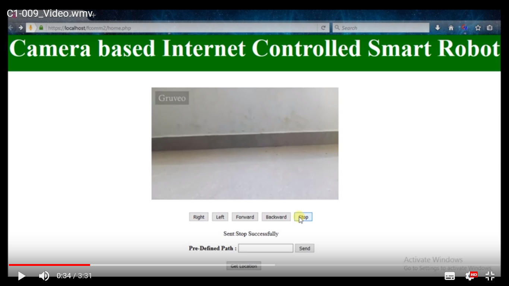

# Real-Time-Internet-Controlled-Smart-Robot-with-Live-Video-Streaming

  In this work, We developed a real-time internet controlled smart robot for carrying
objects that we can control remotely from its lively streamed video surveillance based web
interface.
  The novel aspects of this robot include GSM connectivity through web interface and
automatic detection of obstacles. This work got accepted as paper at **LAMSYS-2016, ISRO** and awarded as **Best Paper**. 
 
 This paper proposes and develops a low cost, real-time internet controlled wireless based unmanned
vehicle for smart factories. The connectivity is provided through GSM and the
remote monitoring of the vehicles is enabled using a high resolution pocket-sized
camera. A simple low cost prototype has been developed which is currently being
used to carry light load objects within a campus environment in a local network. In real, it can be keep as in public domain and control from anywhere.

# Requirements 
 php from WAMP/LAMP Server, Arduino Uno Software

  

